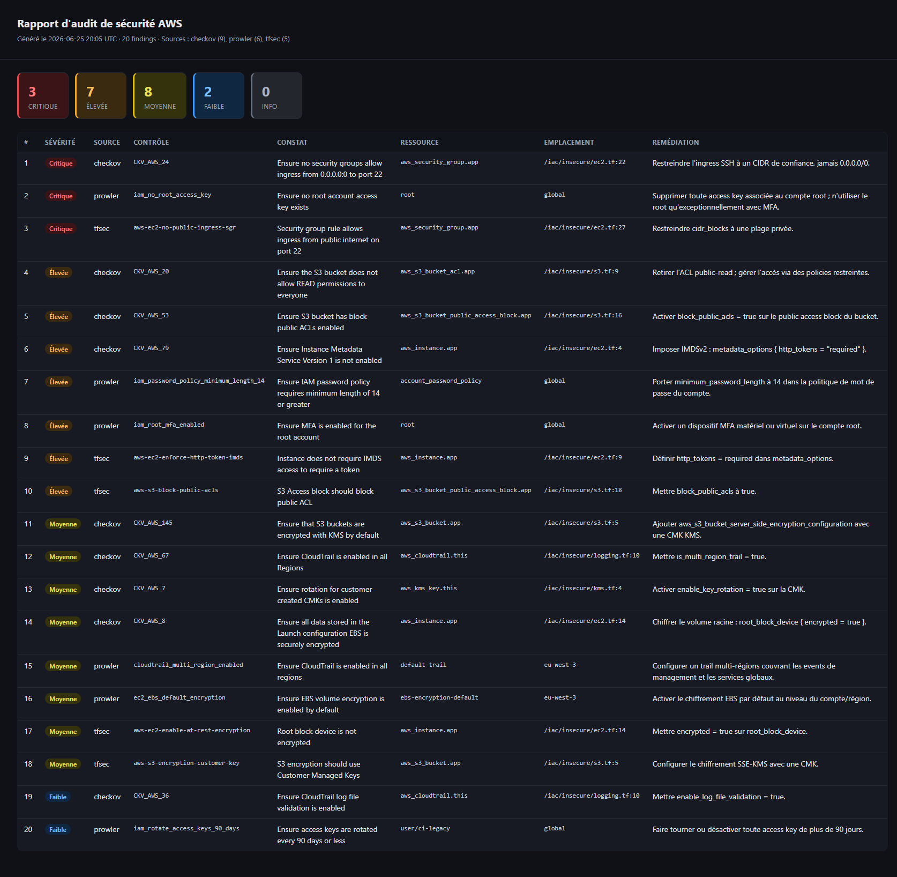

# aws-security-audit

Audit et durcissement de la sécurité d'un compte AWS : gouvernance des accès, contrôles de
sécurité, remédiation. Le dépôt outille une prestation complète — collecte automatisée,
analyse d'infrastructure-as-code, rapport priorisé et exemples de correctifs Terraform — le
tout en **lecture seule** et reproductible en local comme en CI.

## Ce que fait ce dépôt

- **Audit du compte AWS** via [Prowler](https://prowler.com) sur le **CIS AWS Benchmark**, exécutable en local et en CI.
- **Scan IaC** avec **Checkov** et **tfsec** sur du Terraform d'exemple, pour démontrer la détection avant déploiement.
- **Rapport consolidé** (JSON + HTML + grille de remédiation Markdown) à partir des trois sources, sans dépendance externe.
- **Durcissement Terraform avant/après** : S3 public access block, IMDSv2, chiffrement KMS, password policy IAM, CloudTrail, etc.
- **Accès CI par OIDC** : rôle d'audit **read-only / moindre privilège**, **aucune clé statique**.

La démarche complète est décrite dans [`docs/methodology.md`](docs/methodology.md).

## Arborescence

```
.
├─ iac/
│  ├─ insecure/              # Terraform volontairement vulnérable (démo de détection)
│  └─ hardened/              # version durcie — passe fmt/validate/tflint/checkov à 0 finding
├─ terraform/oidc-audit-role # provider OIDC GitHub + rôle d'audit read-only
├─ scripts/                  # run_audit · scan_iac · generate_report (Python stdlib)
├─ config/                   # allowlist Prowler · config Checkov
├─ reports/sample/           # exemple de rapport généré (findings.json · report.html · remediation.md)
├─ docs/                     # méthodologie · grille de remédiation · fixtures
├─ .github/workflows/        # iac-scan (fmt/validate/tflint/checkov/tfsec) · audit (OIDC → Prowler)
└─ Makefile                  # audit · scan-iac · tf-validate · report · sample
```

## Prérequis

| Outil      | Usage                          | Installation                              |
|------------|--------------------------------|-------------------------------------------|
| Terraform  | validation IaC                 | https://developer.hashicorp.com/terraform |
| tflint     | lint Terraform                 | https://github.com/terraform-linters/tflint |
| Checkov    | scan IaC                       | `pip install checkov`                     |
| tfsec      | scan IaC                       | https://github.com/aquasecurity/tfsec     |
| Prowler    | audit du compte AWS            | `pipx install prowler`                    |
| Python 3   | génération du rapport          | —                                         |

> `make deps` indique les outils présents/manquants.
> tfsec est désormais maintenu sous Trivy (`trivy config`) ; le binaire `tfsec` reste fonctionnel.

## Démarrage rapide

### 1. Provisionner l'accès d'audit (une fois)
```bash
cd terraform/oidc-audit-role
cp terraform.tfvars.example terraform.tfvars   # renseigner github_repository
terraform init && terraform apply
terraform output -raw audit_role_arn           # -> secret CI AWS_AUDIT_ROLE_ARN
```

### 2. Auditer le compte (local)
```bash
# credentials AWS exportés au préalable (profil/SSO) — lecture seule
make audit          # Prowler CIS -> reports/
make report         # consolide -> reports/findings.json + report.html + remediation.md
```

### 3. Scanner et valider l'IaC
```bash
make scan-iac       # Checkov + tfsec (gate dur sur hardened/, démo sur insecure/)
make tf-validate    # fmt -check + validate + tflint + checkov sur le Terraform durci
make sample         # régénère reports/sample/ depuis docs/fixtures
```

### En CI
- [`iac-scan.yml`](.github/workflows/iac-scan.yml) — à chaque push/PR : `fmt`/`validate`/`tflint`/`checkov`
  bloquants sur `hardened/` et le rôle OIDC ; scan non bloquant sur `insecure/` publié en artefact.
- [`audit.yml`](.github/workflows/audit.yml) — à la demande ou hebdomadaire : authentification **OIDC**
  vers le rôle read-only, exécution Prowler, rapports publiés en artefacts. Nécessite le secret `AWS_AUDIT_ROLE_ARN`.

## Exemple de rapport

Généré à partir des fixtures (`make sample`) — agrège Prowler, Checkov et tfsec, trié par sévérité :



Artefacts correspondants : [`reports/sample/`](reports/sample/) — `report.html`, `findings.json`,
et la [grille de remédiation](reports/sample/remediation.md).

## Grille de remédiation

Chaque finding est restitué avec sévérité, source, contrôle, ressource, impact et correctif.
Le gabarit est dans [`docs/remediation-grid.md`](docs/remediation-grid.md) ; la version peuplée est
régénérée dans `reports/remediation.md`. Extrait :

| # | Sévérité | Source  | Contrôle      | Ressource                | Correctif                                       |
|---|----------|---------|---------------|--------------------------|-------------------------------------------------|
| 1 | Critique | prowler | `iam_no_root_access_key` | root          | Supprimer les access keys du root, activer MFA  |
| 2 | Critique | checkov | `CKV_AWS_24`  | `aws_security_group.app` | Restreindre l'ingress SSH à un CIDR de confiance |
| 3 | Élevée   | checkov | `CKV_AWS_79`  | `aws_instance.app`       | Imposer IMDSv2 (`http_tokens = "required"`)      |

## Durcissement : avant / après

Les deux modules `iac/insecure` et `iac/hardened` couvrent le même périmètre. Détail complet
dans [`iac/hardened/README.md`](iac/hardened/README.md). En résumé : blocage de l'accès public S3,
chiffrement SSE-KMS, TLS imposé, IMDSv2, chiffrement EBS, default SG verrouillé + VPC flow logs,
password policy IAM conforme CIS, rotation KMS, CloudTrail multi-région avec validation d'intégrité.

## Sécurité & principes

- **Lecture seule.** Aucun script ni workflow ne modifie le compte AWS. Le rôle d'audit n'attache
  que `SecurityAudit` + `ViewOnlyAccess`.
- **Pas de secret en clair.** L'authentification CI passe par OIDC ; aucune clé statique n'est stockée.
- **Exceptions auditables.** Faux positifs et risques acceptés sont documentés (allowlist Prowler,
  `#checkov:skip` justifiés), jamais masqués silencieusement.
- **Déterminisme.** Le scan IaC ne télécharge pas de modules externes ; le rapport n'utilise que la
  bibliothèque standard Python (aucun appel réseau).
